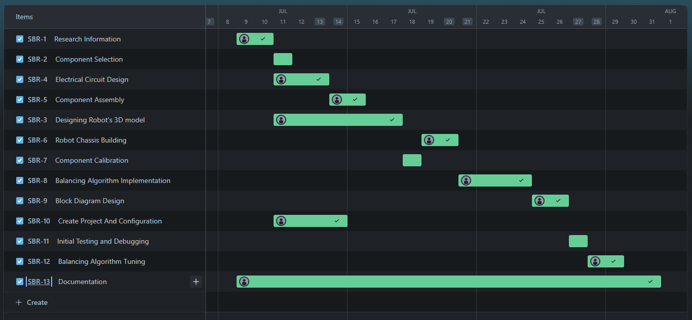
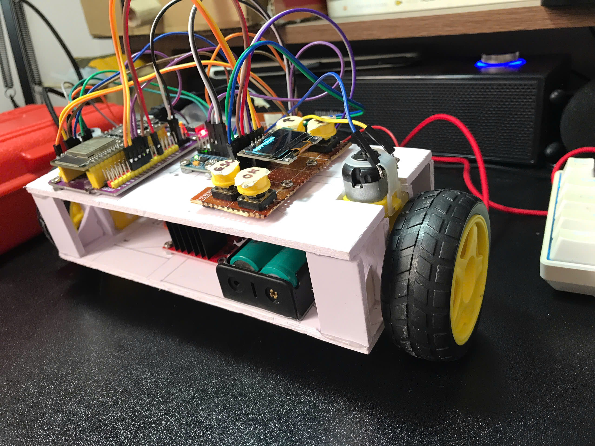

# SELF-BALANCING ROBOT 

This repository has five branches:

- `main`: This contains main script for robot,
- `PID_block_component`: This contains script for PID implementation.
- `display_controller_feature`: This contains script for displaying UI on OLED.
- `mpu_reader_feature`: This contains script for reading acceleration and gyroscope values.
- `cleaning_code`: Change code style to OOP and cleaning all script.

## Overview
This project presents the design, implementation, and control of a self-balancing two-wheeled robot. Unlike traditional self-balancing robots, this project incorporates a user interface (UI) for initialization, parameter observation, and tuning of the PID controller, including Kp, Ki, and Kd gains, as well as a setpoint. These parameters are stored in the ESP32’s non-volatile memory to ensure data persistence even after power cycles. Self-balancing robots have gained significant attention in recent years due to their potential applications in various fields, such as transportation, robotics, and education.

## Components
### Hardware:
- ESP32 WROOM 32
- MPU 6050
- I2C OLED 0.96 inches
- Buttons
- Li-on batteries 3.7V 1200mAh
- 2-pins pack
- L298N motor driver
- DC motors and wheel
- Jump wires 

### Software:
- **IDE**: Visual Studio Code and installing PlatformIO extension for developing on hardware.
- **Library**:

    - `adafruit/Adafruit SSD1306@^2.5.10`
	- `adafruit/Adafruit GFX Library@^1.11.9`
	- `adafruit/Adafruit Unified Sensor@^1.1.14`
	- `adafruit/Adafruit MPU6050@^2.2.6`
	- `adafruit/Adafruit BusIO@^1.16.1`

## Implement Timeline
According to the plan, the project will be implemented from July 9, 2024 to July 31, 2024, but due to some technical problems, the project will not be officially completed until August 13, 2024.

## Result
You can watch the demo video on my youtube channel by clicking [here](https://youtu.be/lndcBkw4cso). 

